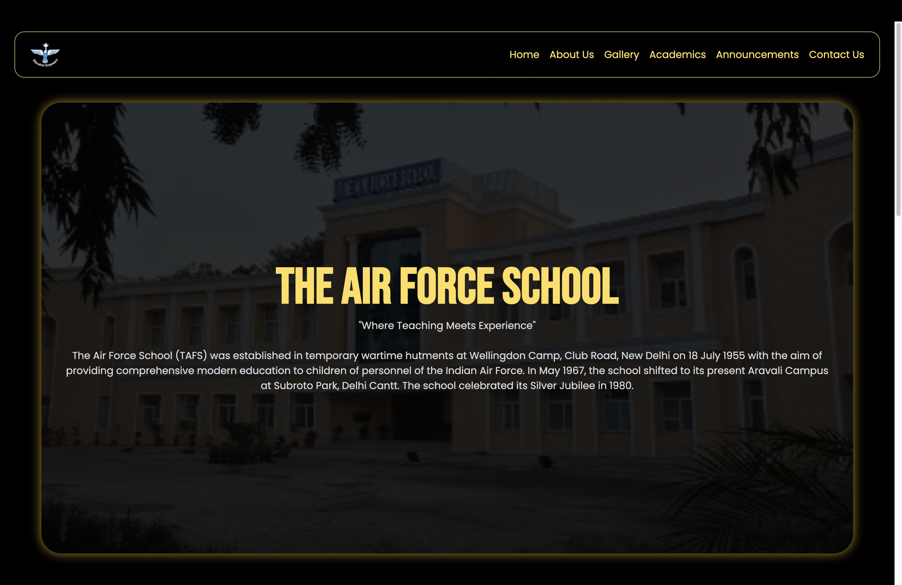
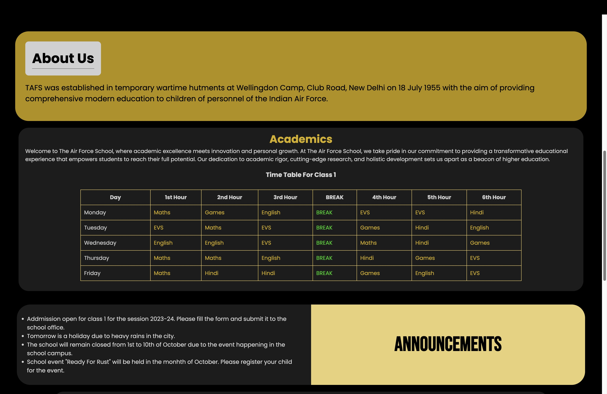
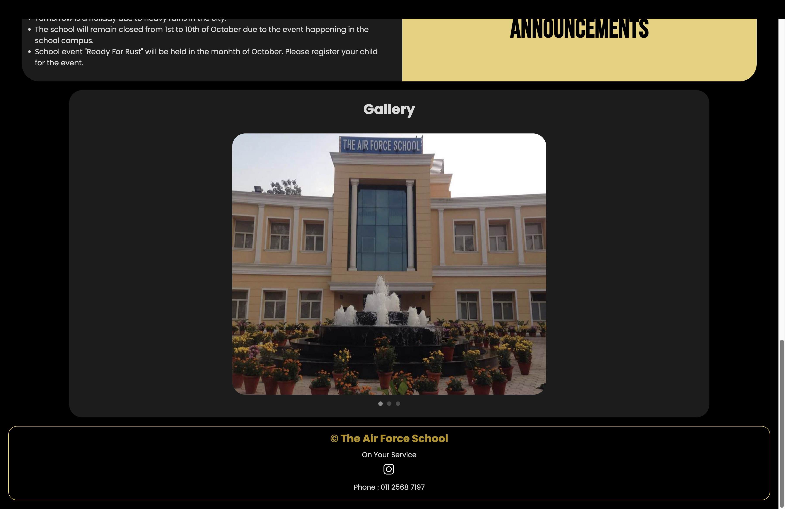

<h1>The Air Force School Website</h1>

Made this website as a task for a club.
<h2>General Information</h2>

<ul>
<li>This is a single page website that accounts for major tasks such as announcements and time table for a school website.</li>
</ul><ul>
<li>It acts as a Student Portal for the earliest official news.</li>
</ul><h2>Technologies Used</h2>

<ul align="center">
 

</ul><h2>Features</h2>

<ul>
<li>Responsive</li>
</ul><ul>
<li>Clean UI</li>
</ul><h2>Screenshots</h2>

<h2>Setup</h2>

Download the repository and open index.html in the browser.
<h5>Steps</h5><ul>
<li><code>git clone https://github.com/TartejBrothers/The-Air-Force-School.git</code></li>
</ul><ul>
<li><code>cd the-air-force-school-main</code></li>

</ul>
<h2>Project Status</h2>

The website is ready and hosted <a href="https://theairforceschool.web.app/">here</a>
<h2>Improvements</h2>

<ul>
<li>Separate Pages can be added instead of Single Page Website.</li>
</ul><ul>
<li>Attendance data can be added.</li>
</ul><ul>
<li>Marks can be added.</li>
</ul><h2>Contact</h2>

